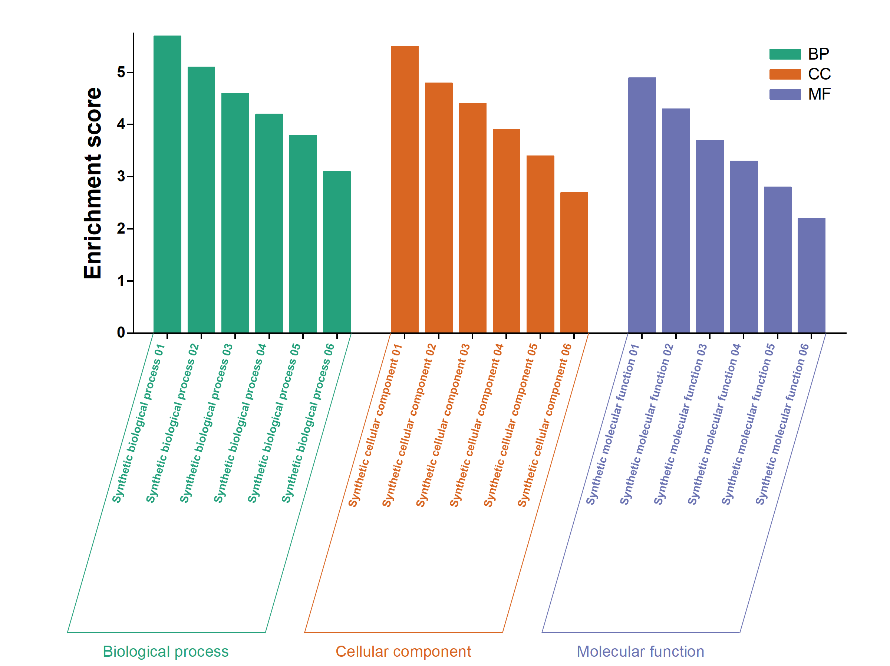

# GO 富集柱形图示例

这是通用 Origin 科研作图技能的一个专项示例，适用于已有 GO term、分组和 Enrichment score 的数据表。其他图型从 [技能入口](../SKILL.md) 按任务处理，无需使用本示例的数据格式。

当前 [demo.csv](../examples/go-enrichment/demo.csv) 包含 18 行人工合成数据，三个分组各 6 行。所有名称以 `Synthetic` 开头，是虚构条目而非真实 GO term；数值人为设置，仅演示布局和数据绑定，不来自研究数据。此示例只绘图，不执行富集分析，不将得分默认转换为 −log10(P)，不自动筛选条目。



## 运行

先检查本机 Origin 和 Python 环境；脚本使用独立隐藏的 Origin 实例。

```powershell
python scripts/plot_go_enrichment.py --input examples/go-enrichment/demo.csv --validate-only
python scripts/plot_go_enrichment.py --input examples/go-enrichment/demo.csv --output-dir outputs/go-demo
```

在仓库目录运行，输出目录须为新目录或空目录。生成 `go_enrichment.opju`、从重开后的 Origin 项目导出的 `go_enrichment.png`，以及 `verification/verification.json`。OPJU 包含一个图页、一个图层和三个原生柱形系列，内嵌绘图数据。

输入支持 CSV 和 XLSX。必须包含 `GOterm`、`subgroup`、`Enrichment score`；分组全称为 Biological process、Cellular component、Molecular function。每组至少一行，允许各组条目数不同。同组重复 term、缺失值、非有限得分或负值会报错，不能静默删除。

组内保持输入顺序，图中按 BP、CC、MF 排列。`--label-size`、`--rotation`、`--page-width`、`--page-height`、`--y-max` 和 `--y-step` 可调整样式；完整参数见 `--help`。已有独立安装的 originpro 时，可用 `--dependency-path` 指定该包的父目录，无需改动全局 Python。

## 在 Origin 中继续编辑

- `GOData` → `PlotData` 中的 BP / CC / MF 列控制柱高；空白表示该条目不属于相应系列。
- `Tick label` 列控制横轴显示文字，带有 Origin 颜色格式。保留格式，修改其中的名称即可。
- `Source` 表是输入快照，绘图修改使用 `PlotData` 表。
- 双击柱形调整系列样式，双击坐标轴调整范围和刻度。分组框、分组名称、纵轴标题与关联系列的图例均可编辑。
- 外部 OPJU 与 PPT 中的嵌入副本不会自动同步。

## 已验证的 Origin 细节

- 单个图层包含三个原生 column plot，分别绑定三个 Y 列。
- 组间留白使用跳过的 X 位置；工作表只包含真实观测行。原始行号保存在 `Source row`，用于核对分组后顺序。
- `layer.x.ticksbydata$` 显式设置真实条目的 X 位置。自定义刻度与文本标签按顺序匹配，标签列不能再插入组间空白行，否则后续组标签可能错位。
- 标签列使用 Origin 原生富文本颜色格式，横轴统一旋转。标签偏移需要结合实际字号和刻度长度检查。
- 三条原生线构成各组底部斜框；分组名称是原生文本。图例使用关联数据系列的 `\l(...)`，保留颜色关联。
- 保存重开后，标签引用可能显示为完整工作表范围，而绘图对象返回短数据集名称。核验时应比较实际工作表与列的对应，不能仅比较这两种表示的原始字符串。

脚本默认样式为约 240 × 180 mm 页面、74° 标签、BP `#25A17C` / CC `#D96622` / MF `#6C73B2`。它是示例，不应覆盖用户提供的新参考风格。

脚本会重开核验数据、来源行、标签、颜色和绘图引用，并导出预览。实际视觉检查仍需确认长标签不碰框、各条目清晰、图形不越界。修改点线样式不重新计算统计结果。
